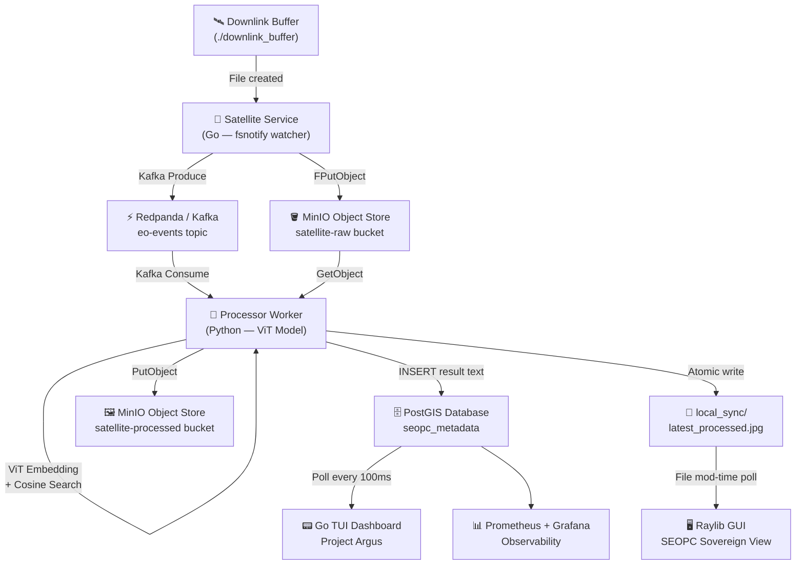

# Project Argus — Satellite Geo-Localization Pipeline

> **A fully containerized, event-driven satellite intelligence system** that ingests raw satellite imagery, geo-localizes it using a Vision Transformer model, and streams live telemetry to a terminal dashboard and real-time GUI viewer.

---

## Architecture



---

## Components

| Service | Language | Role |
|---|---|---|
| `satellite/` | Go | Watches `downlink_buffer/`, uploads to MinIO, produces Kafka events |
| `processor/` | Python | Consumes Kafka, runs ViT geo-localization, writes to PostGIS |
| `dashboard/` | Go (Bubbletea TUI) | Polls PostGIS, renders live telemetry in terminal |
| `gui/` | C (Raylib) | Hot-reloads `local_sync/latest_processed.jpg` as satellite imagery viewer |
| `cv/` | Python | Offline script used to generate `embeddings.npy`, `lats.npy`, `lons.npy` |
| `tiles/` | — | Pre-tiled satellite imagery dataset used as reference embeddings |
| `observability/` | Prometheus + Grafana | Metrics collection and visualization |

---

## How It Works

1. **Image Ingestion** — A file is dropped into `downlink_buffer/` (via `feed.sh` or manually). The Go satellite service detects it via `fsnotify`, uploads it to MinIO's `satellite-raw` bucket, and publishes a JSON event to the `eo-events` Kafka topic.

2. **Geo-Localization** — The Python processor consumes the Kafka event, fetches the image from MinIO, and passes it through a pretrained **ViT-Base/16** (Vision Transformer) model to produce a 768-dimensional CLS token embedding. It performs a **cosine similarity search** against 874 pre-built tile embeddings, takes the top-5 matches, and computes a weighted mean GPS coordinate — yielding a predicted latitude and longitude.

3. **Storage & Display** — The result is inserted into PostGIS as `result text`. The processed image is saved to `local_sync/latest_processed.jpg`. The Go TUI dashboard polls PostGIS every 100ms and renders scene counts, latency, and detection results live. The Raylib GUI polls the local file's modification time and hot-reloads it whenever it changes.

---

## Quick Start

### Prerequisites

- Docker + Docker Compose
- WSL2 (Debian/Ubuntu recommended) or native Linux
- Go 1.21+
- GCC + libraylib-dev (for GUI)
- tmux

### One-Command Launch

```bash
git clone https://github.com/your-username/seopc-project.git
cd seopc-project
chmod +x launch.sh feed.sh
./launch.sh
```

This will:
- Bring up all Docker services in dependency order (Redpanda → MinIO → PostGIS → Satellite → Processor)
- Wait for PostGIS to be healthy
- Open a tmux session with 4 panes (logs / dashboard / GUI / feeder)

Use `./launch.sh --rebuild` to force a Docker image rebuild.

### Feeding Images

The `feed.sh` script automatically drip-feeds tiles from `tiles/` into the pipeline:

```bash
bash feed.sh          # One tile every 5 seconds (default)
bash feed.sh 30       # One tile every 30 seconds
```

Or manually trigger a single inference:
```bash
sudo docker cp tiles/tile_0001.jpg seopc-project-satellite-1:/downlink_buffer/
```

### Stopping

Press `Q` in the dashboard pane to exit the TUI, then:
```bash
sudo docker compose down
```

---

## CV Model Details

- **Architecture**: `vit_base_patch16_224` via `timm` (pretrained on ImageNet)
- **Embedding**: CLS token (768-dim), L2-normalized
- **Retrieval**: Cosine similarity against 874 reference tile embeddings
- **Prediction**: Weighted mean of top-5 match GPS coordinates
- **Dataset**: Tiles generated from Sentinel-2 satellite imagery over the Mumbai/Navi Mumbai region

---

## Observability

Prometheus scrapes metrics at `localhost:9090`. Grafana dashboards are available at `localhost:3000`.

---

## Project Structure

```
seopc-project/
├── satellite/          # Go — file watcher & Kafka producer
├── processor/          # Python — ViT inference worker
│   ├── worker.py
│   ├── embeddings.npy  # Pre-built tile embeddings (874 × 768)
│   ├── lats.npy        # Reference latitudes
│   └── lons.npy        # Reference longitudes
├── dashboard/          # Go — Bubbletea TUI
├── gui/                # C — Raylib image viewer
├── cv/                 # Python — offline embedding generator
├── tiles/              # Reference satellite tile images
├── observability/      # Prometheus config
├── downlink_buffer/    # Hot drop zone for new satellite images
├── local_sync/         # Shared file between processor and GUI
├── docker-compose.yml
├── launch.sh           # One-command tmux launcher
└── feed.sh             # Automated tile feeder
```

---

## License

MIT
